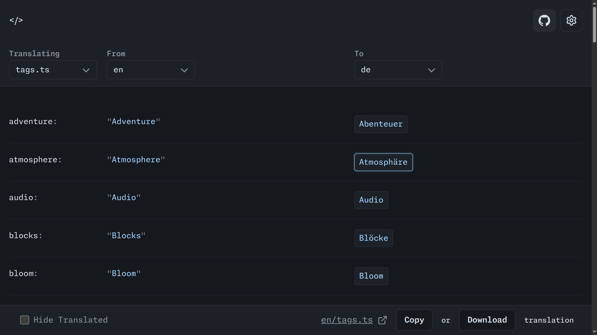
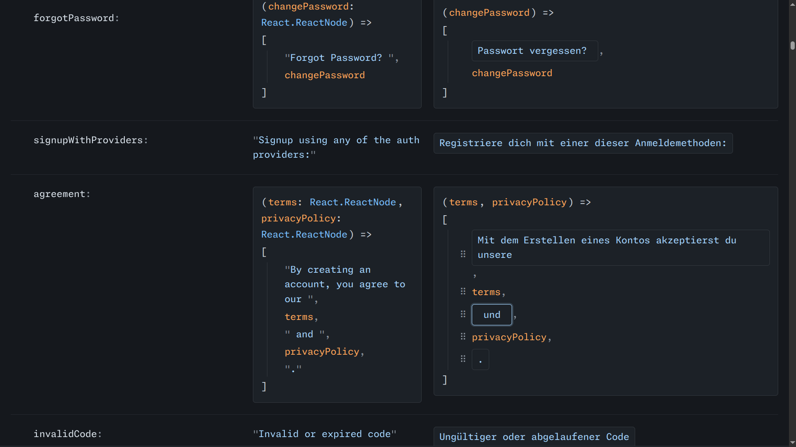

### Web editor for Typescript/Javascript based translation files

#### Try it out at https://ts-locale-editor.vercel.app

**Features**:

- Can parse and display JS/TS objects in a editor UI
- Can assemble the edited translation back to JS/TS while preserving the structure of the file.
- Can fetch from custom github repos
- Supports function expressions and arrow functions
- Allows to nicely edit functions returning arrays

**Built using**:

**Screenshots**:

